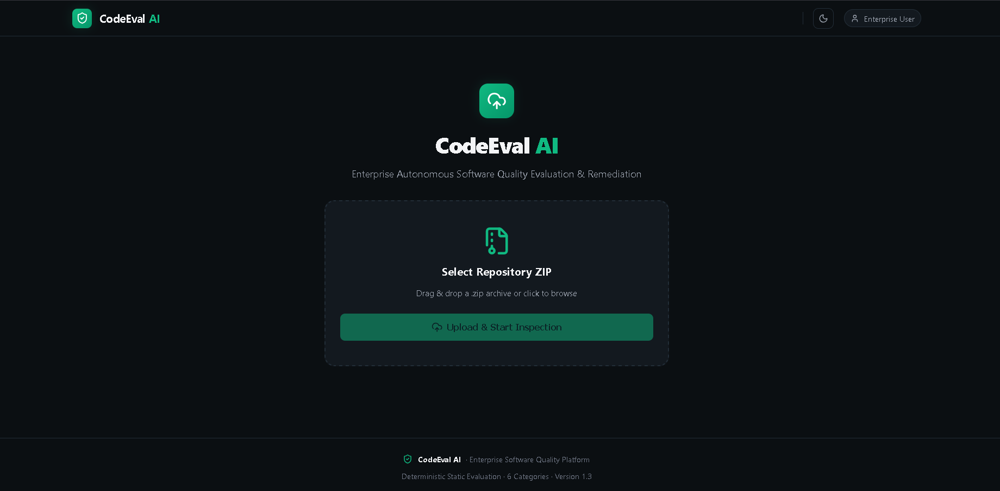
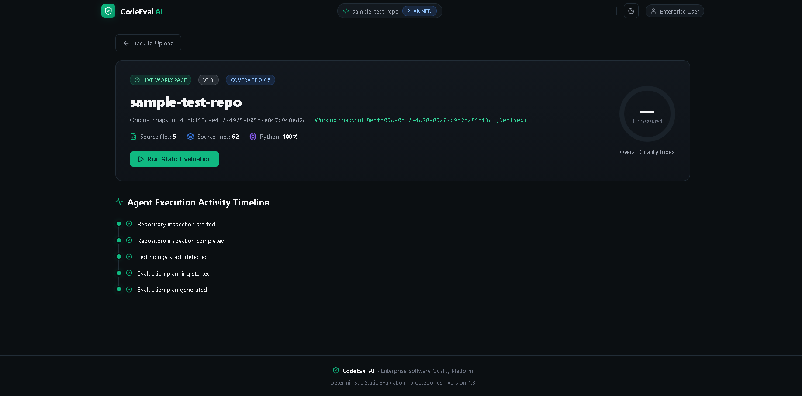
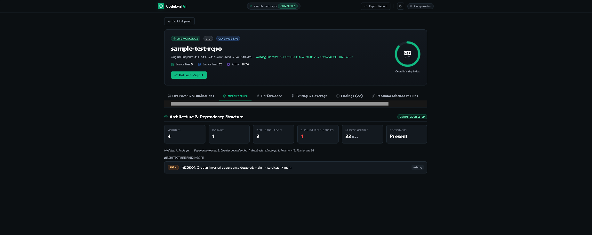
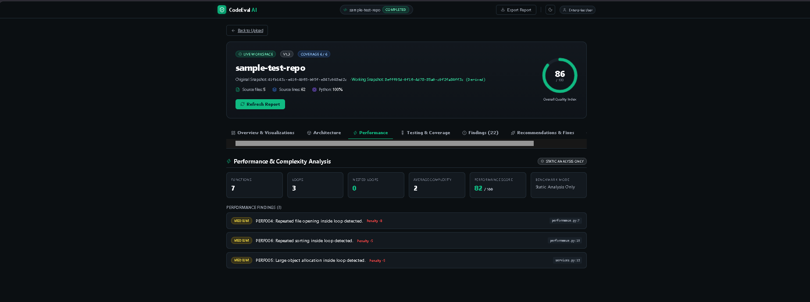
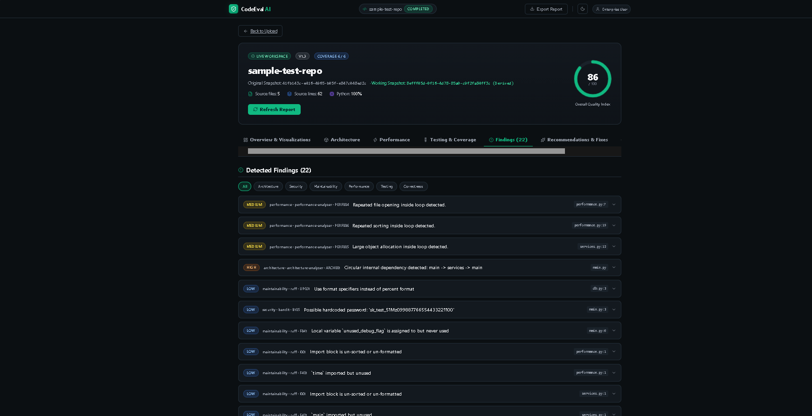
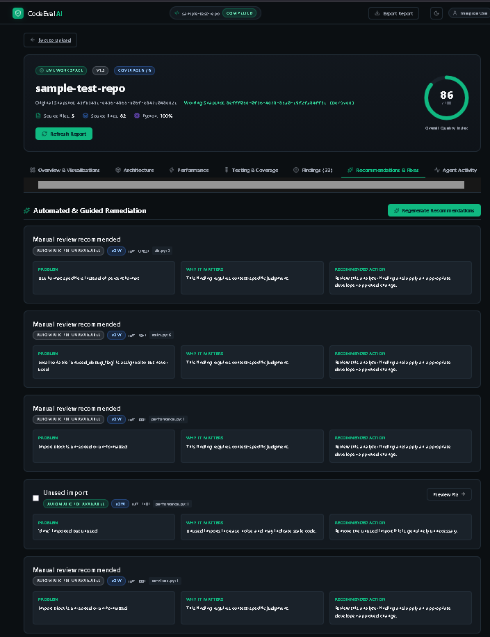
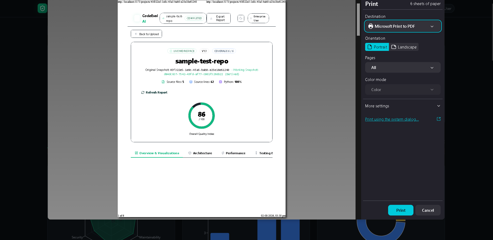

<div align="center">

# 🚀 CodeEval AI

### Enterprise Autonomous Software Quality Evaluation & Remediation Platform


---

### 🔍 Analyze • 📊 Score • 🛡 Secure • ⚡ Optimize • 📄 Export

**CodeEval AI** is an enterprise-grade static software quality evaluation platform inspired by GitHub Advanced Security, SonarCloud, Datadog and modern DevSecOps tooling.

It automatically analyzes repositories, performs multi-dimensional software quality evaluation, generates deterministic scores, identifies architectural issues, security vulnerabilities, maintainability problems, performance bottlenecks, testing metrics, and exports a professional PDF report.

</div>

---

# 📸 Application Preview

> Replace these with screenshots from your project.

## Landing Page



## Dashboard



## Architecture Analysis



## Performance Analysis



## Findings Explorer



## Recommendations



## PDF Report



---

# ✨ Features

## 📂 Repository Inspection

- Upload Repository ZIP
- Automatic project detection
- Snapshot generation
- Language detection
- Repository statistics
- File discovery

---

## 🏗 Static Quality Evaluation

✔ Architecture Analysis

✔ Security Analysis

✔ Maintainability Analysis

✔ Performance Analysis

✔ Testing Analysis

✔ Correctness Evaluation

---

## 📊 Intelligent Score Engine

Automatically generates:

- Overall Quality Score
- Architecture Score
- Security Score
- Performance Score
- Testing Score
- Maintainability Score
- Correctness Score

Example

| Category | Score |
|----------|-------|
| Architecture | 88 |
| Security | 82 |
| Maintainability | 84 |
| Performance | 82 |
| Testing | 95 |
| Correctness |100|

---

# 📈 Interactive Dashboard

Modern enterprise dashboard including

✅ Animated score cards

✅ Circular Quality Gauge

✅ Radar Chart

✅ Bar Chart

✅ Pie Chart

✅ Progress Indicators

✅ Live Evaluation Timeline

✅ Static Analyzer Status

---

# 🔍 Static Analysis Engines

Integrated analyzers

- Ruff
- Bandit
- PyTest
- Custom Architecture Analyzer
- Custom Performance Analyzer

---

# 🏛 Architecture Analyzer

Detects

- Circular dependencies
- Module relationships
- Package structure
- Dependency graph
- Largest module
- Documentation presence

---

# ⚡ Performance Analyzer

Detects

- Duplicate expensive computations
- Nested loops
- File opening inside loops
- Sorting inside loops
- High complexity functions
- Performance penalties

---

# 🔒 Security Analyzer

Detects

- Unsafe assertions
- Security smells
- Potential vulnerabilities
- Static security issues

---

# 🧪 Testing

Displays

- Tests collected
- Tests passed
- Coverage
- Duration
- Errors
- Failures

---

# 📋 Findings Explorer

Supports

- Severity filtering
- Category filtering
- Expandable findings
- File location
- Rule ID
- Description

Severity

🟥 High

🟧 Medium

🟨 Low

---

# 🛠 Recommendation Engine

Every finding contains

✔ Problem

✔ Why It Matters

✔ Recommended Action

✔ Preview Fix

✔ Automatic Fix Availability

✔ Manual Review Suggestions

---

# 📄 Professional PDF Report

Generate a complete enterprise-quality report including

- Executive Summary
- Repository Information
- Overall Score
- Category Scores
- Architecture
- Performance
- Security
- Testing
- Findings
- Recommendations
- Charts
- Static Analysis Results
- Agent Timeline
- Generated Timestamp

---

# 🎨 Enterprise UI

Inspired by

- GitHub Advanced Security
- SonarCloud
- Datadog
- Vercel
- Linear
- Cursor IDE

Features

✔ Dark Theme

✔ Mint Accent

✔ Responsive Layout

✔ Modern Cards

✔ Animated Components

✔ Interactive Charts

✔ Professional Typography

---

# 🛠 Tech Stack

## Frontend

- React
- Vite
- TailwindCSS
- Recharts
- JavaScript

## Backend

- Python
- FastAPI
- PyTest
- Ruff
- Bandit

---

# 📁 Project Structure

```
CodeEval-AI
│
├── backend
│   ├── app
│   ├── services
│   ├── tests
│   └── requirements.txt
│
├── frontend
│   ├── src
│   ├── components
│   ├── utils
│   └── package.json
│
├── docs
│
├── README.md
│
└── .gitignore
```

---

# 🚀 Installation

## Clone Repository

```bash
git clone https://github.com/yourusername/CodeEval-AI.git

cd CodeEval-AI
```

---

## Backend

```bash
cd backend

python -m venv venv

venv\Scripts\activate

pip install -r requirements.txt

uvicorn app.main:app --reload
```

---

## Frontend

```bash
cd frontend

npm install

npm run dev
```

---

# 📊 Workflow

```
Upload Repository

↓

Repository Detection

↓

Static Analysis

↓

Security Analysis

↓

Architecture Analysis

↓

Performance Analysis

↓

Testing

↓

Scoring Engine

↓

Recommendation Engine

↓

Interactive Dashboard

↓

PDF Export
```

---

# 📈 Future Enhancements

- AI-powered code review
- Multi-language support
- CI/CD Integration
- GitHub App
- GitLab Integration
- Bitbucket Support
- Docker Deployment
- Team Collaboration
- Cloud Dashboard
- Historical Comparisons

---

# 👨‍💻 Developer

**Kalaigar Mukhtar Ahmed**

Computer Science & Engineering


---

<div align="center">

### ⭐ If you like this project, don't forget to Star the repository!

Made with ❤️ using Python, FastAPI, React & Modern DevSecOps

</div>
